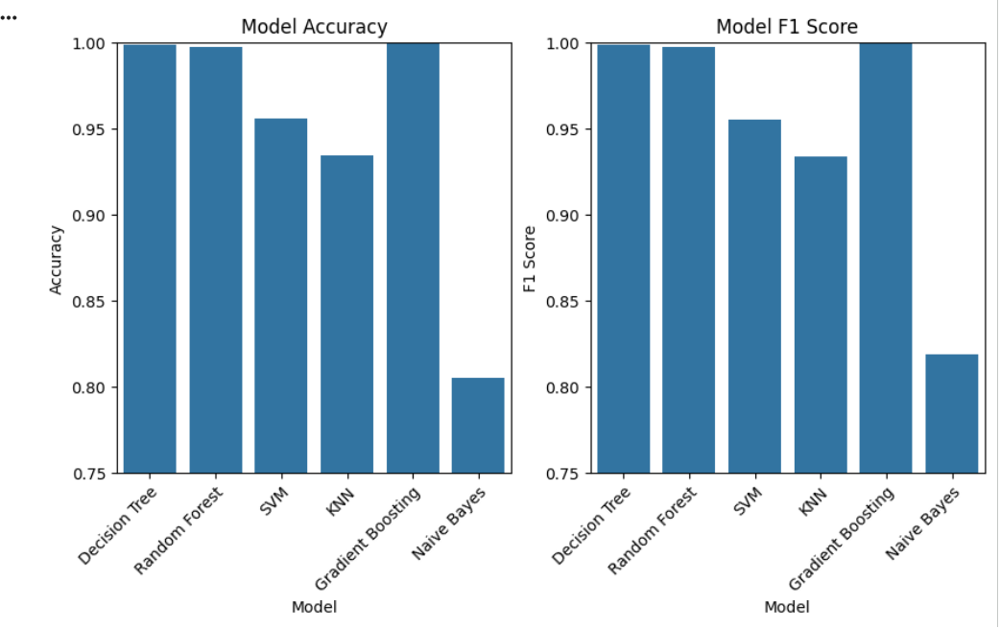
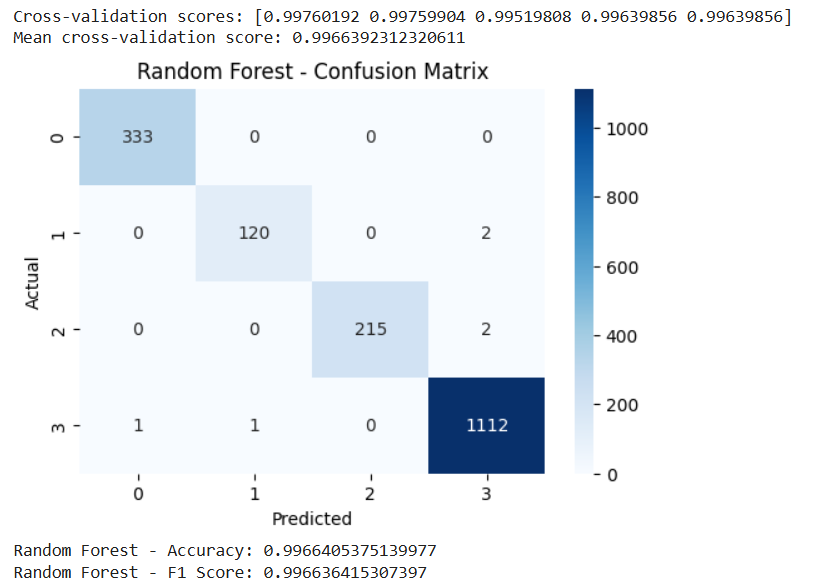

# SmartTrafficSystem-MachineLearning

A machine learning system for classifying real-time urban traffic conditions into four categories — **Heavy, High, Normal, and Low** — based on vehicle counts, time of day, and day of the week.

---

## Overview

Managing urban traffic efficiently requires accurate, real-time insight into road conditions. This project develops a multi-class traffic situation classifier trained on data collected by a computer vision system, enabling automated identification of traffic states to support adaptive signal control and urban traffic management.

Six classification algorithms were evaluated, with **Random Forest** selected as the final model based on superior accuracy and F1 score. The final model was optimized using **Optuna** for hyperparameter tuning and trained with **SMOTE** to address class imbalance, validated through **Stratified K-Fold Cross-Validation**.

---

## Traffic Classes

| Class | Label | Description |
|-------|-------|-------------|
| 1 | Heavy | Severely congested traffic |
| 2 | High | Above-normal traffic volume |
| 3 | Normal | Typical traffic flow |
| 4 | Low | Minimal traffic |

---

## Models Evaluated

| Model | Notes |
|-------|-------|
| Decision Tree | Baseline tree-based classifier |
| **Random Forest** | **Final model — tuned with Optuna** |
| Support Vector Machine | Kernel-based classifier |
| K-Nearest Neighbors | Distance-based classifier |
| Gradient Boosting | Ensemble boosting method |
| Naive Bayes | Probabilistic baseline |

---

## Results

### Model Comparison — Accuracy & F1 Score

### Confusion Matrix — Random Forest (Final Model)

---

